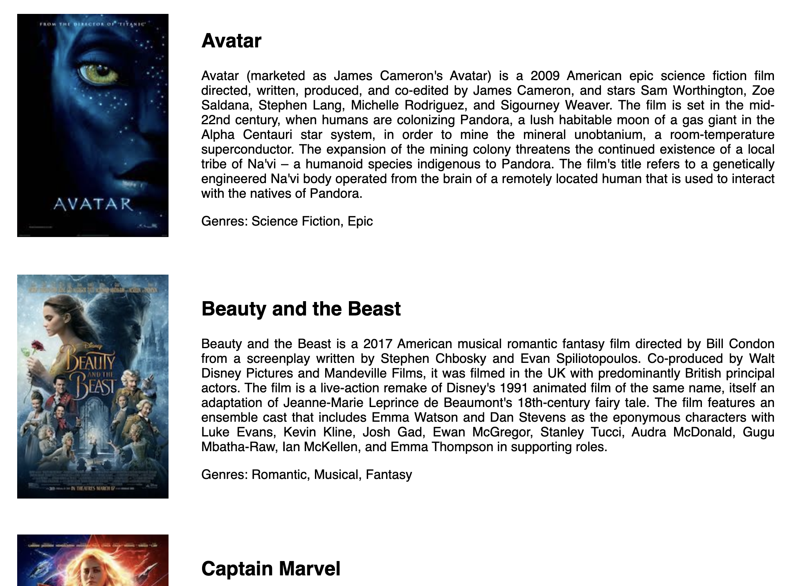
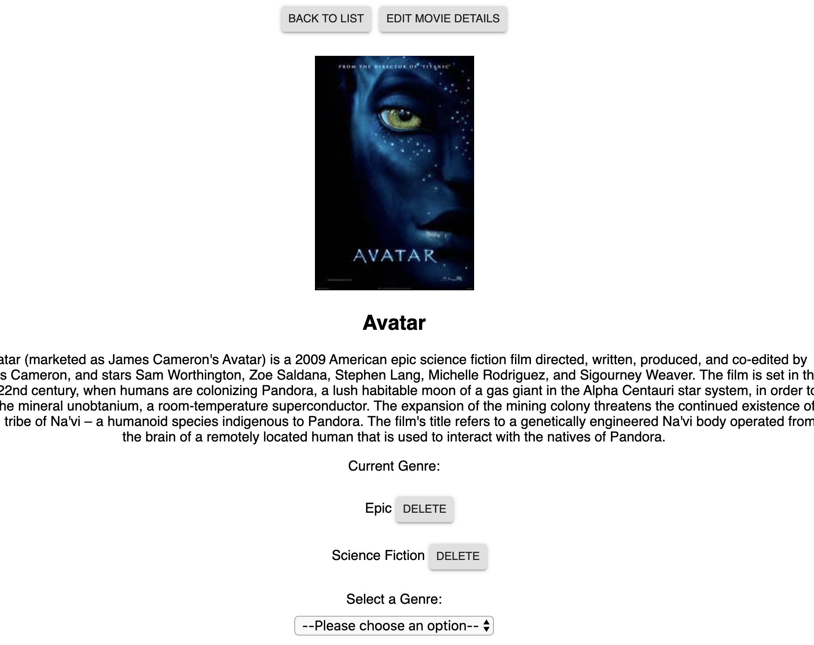
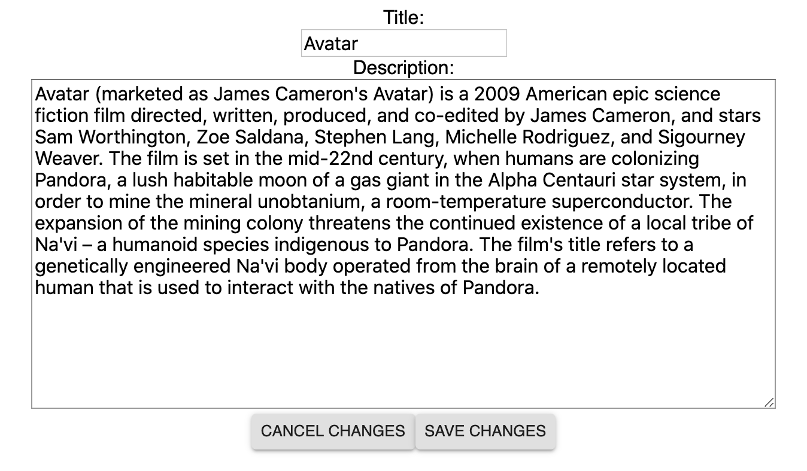

# Weekend Challenge - React-Redux with Sagas

[Link](./INSTRUCTIONS.md) to project instructions.

## Description

For this weekend challenge, I created a web application that displays a list of movies, including a poster of the movie, the movie title, a description of the movie and the movie genres.

A user could click on a movie, to see details of the movie. On the top part details page of the movie, there are two buttons, "Back to List" and "Edit Movie Details". The "Back to List" button takes the user back to the movie list page. The "Edit Movie Details" button takes the user to an edit page. There are two input fields which allows the user to edit the movie title and movie description on the edit page. Under the input fields, there are two buttons, "Cancel Changes" and "Save Changes". The "Cancel Changes" takes the user back to the details page. The "Save Changes" will save the edits and also takes the user to the details page where the user can see that the content reflect the changes made.

The details page also displays the movie poster, the movie title, the movie description and a list of the movie genres. Next to each genre, there is a "Delete" button that allows a user to delete the genre. Under the list of genres, there is a select input box, a user could select a genre from the pre-populated list and click the "Add Genre" button to add a genre to the movie.

## Screen Shot

### ### Home Page / Movie List Page

Details Page

### Edit Page

## Prerequisites

- [Node.js](https://nodejs.org/en/)
- [Postgresql](https://www.postgresql.org/download/)
- [Postico](https://eggerapps.at/postico/)

## Installation

1. Create a database named `saga_movies_weekend`,
2. The queries in the `database.sql` file are set up to create all the necessary tables and populate the needed data to allow the application to run correctly. The project is built on [Postgres](https://www.postgresql.org/download/), so you will need to make sure to have that installed. We recommend using Postico to run those queries as that was used to create the queries,
3. Open up your editor of choice and run an `npm install`
4. Run `npm run server` in your terminal
5. Run `npm run client` in your terminal
6. The `npm run client` command will open up a new browser tab for you!

## Built With

css, javascript, node, express, body-parser, pg, SQL, Postman, Postico, Postgres, axios, react, react-router, redux, redux-saga, material-UI

## Acknowledgement

Thanks to [Prime Digital Academy](www.primeacademy.io) who equipped and helped me to make this application a reality.

## Support

If you have suggestions or issues, please email me at [beileiwang@gmail.com](beileiwang@gmail.com).
